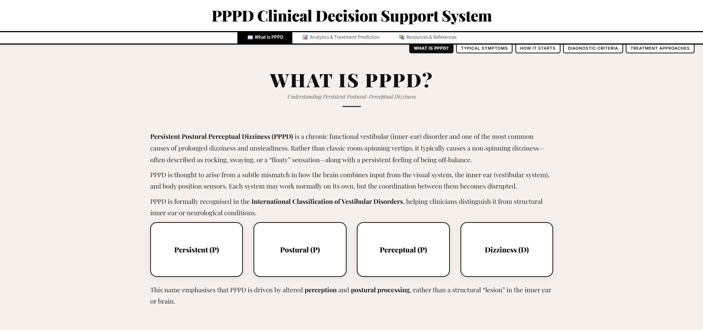

# PPPD Clinical Decision Support System

[](https://pppd-clinical-decision-support.streamlit.app/)

A machine learning-powered web application for predicting vestibular rehabilitation therapy (VRT) outcomes in patients with **Persistent Postural-Perceptual Dizziness (PPPD)**.

Built as a portfolio project for MSc Health Analytics / Health Data Science programme admission in Hong Kong — demonstrating the integration of clinical domain knowledge, machine learning methodology, and interactive data visualisation.

**[▶ Try the Live Demo](https://pppd-clinical-decision-support.streamlit.app/)**

---

## Demo



> *Screenshot of the PPPD Clinical Decision Support System dashboard.*

---

## What is PPPD?

Persistent Postural-Perceptual Dizziness is a chronic functional vestibular disorder characterised by non-spinning dizziness, unsteadiness, and sensitivity to visual motion. It is one of the most common causes of chronic dizziness, formally recognised in the International Classification of Vestibular Disorders (Staab et al., 2017).

## Project Overview

This system predicts how well a PPPD patient will respond to two types of rehabilitation:
- **Traditional Vestibular Rehabilitation Therapy (VRT)** — customised balance and gaze exercises
- **VR-Enhanced VRT** — virtual reality-based vestibular desensitisation

The model takes **8 clinical features** (baseline DHI score, anxiety level, visual sensitivity, symptom duration, trigger count, migraine comorbidity, anxiety disorder, age) and predicts **treatment response rates** (% improvement in DHI score).

### Key Design Decision
The model predicts *response rates* rather than absolute post-treatment scores. This ensures the ML learns what **drives treatment success** (anxiety, comorbidities, symptom duration) rather than just memorising baseline severity — producing a clinically meaningful and balanced feature importance profile.

---

## Project Structure

```
Code/
├── app.py                  # Streamlit dashboard (3 tabs)
├── train_model.py          # ML training pipeline
├── analysis.ipynb          # Jupyter notebook — EDA, model comparison, reflections
├── constants.py            # Literature-derived constants and references
├── training_data.csv       # Generated training dataset (500 samples)
├── pppd_vrt_model.pkl      # Trained Random Forest model
├── model_metrics.json      # CV & test-set evaluation metrics (auto-generated)
├── participants.tsv        # Real demographics from OpenNeuro ds004460
├── participants.json       # BIDS column descriptions
├── dataset_description.json # Dataset metadata
├── requirements.txt        # Python dependencies
├── main.css                # Dashboard styling
├── scroll.css              # Layered scroll component CSS
├── .streamlit/             # Streamlit config
└── .venv/                  # Python virtual environment
```

---

## Setup & Installation

### Prerequisites
- Python 3.10+
- pip

### Steps

```bash
# 1. Navigate to the project
cd "Project 1/Code"

# 2. Create and activate virtual environment
python -m venv .venv
.venv\Scripts\activate        # Windows
# source .venv/bin/activate   # macOS/Linux

# 3. Install dependencies
pip install -r requirements.txt

# 4. Train the model
python train_model.py

# 5. Run the app
streamlit run app.py
```

---

## Methodology

### Data Pipeline

1. **Real demographics** loaded from [OpenNeuro ds004460 v1.1.0](https://openneuro.org/datasets/ds004460/versions/1.1.0) (Gramann et al., 2021) — 20 participants with age, sex, handedness
2. **Bootstrap up-sampling** to n=500 with age jitter (±2 years) to create sufficient training variance
3. **Clinical variable simulation** using a latent-variable approach grounded in published literature:
   - Baseline DHI: mean ~52, SD ~14 (Staab et al., 2017)
   - Anxiety: correlated with disease severity (Popkirov et al., 2018)
   - Symptom duration: log-normal, mean ~14 months (Bittar & von Söhsten Lins, 2015)
   - Comorbidities: migraine ~35%, anxiety disorder ~40% (Herdman et al., 2020)
4. **Treatment response simulation** based on meta-analysis effect sizes:
   - Traditional VRT: ~42% DHI reduction, modulated by anxiety, duration, comorbidities
   - VR-VRT: ~52% reduction, superior for visual sensitivity (Micarelli et al., 2019)

### Model

- **Algorithm:** Multi-output Random Forest Regressor (200 trees, max depth 8)
- **Target:** Treatment response rate (% DHI improvement) for both VRT and VR-VRT
- **Evaluation:** 5-fold cross-validation comparing Linear Regression, Random Forest, and Gradient Boosting
- **Features (8):** Age, Baseline DHI, Anxiety, Visual Sensitivity, Symptom Duration, Trigger Count, Migraine, Anxiety Disorder

### Feature Importance

| Feature | Importance | Clinical Rationale |
|---------|-----------|-------------------|
| Anxiety | ~0.49 | Primary moderator of VRT engagement (Popkirov 2018) |
| Visual Sensitivity | ~0.16 | Key driver of VR response (Micarelli 2019) |
| Migraine | ~0.13 | Limits VR tolerance |
| Trigger Count | ~0.08 | Multi-trigger = more complex dysfunction |
| Symptom Duration | ~0.07 | Chronicity reduces treatment response |
| Baseline DHI | ~0.04 | Low importance for *rate* prediction (by design) |
| Age | ~0.03 | Mild effect on response |
| Anxiety Disorder | ~0.01 | Captured partially through anxiety score |

---

## Limitations & Honest Reflection

### What this project does well
- Integrates clinical domain knowledge with ML methodology
- Uses a transparent, literature-grounded simulation with explicit documentation
- Chooses a meaningful prediction target (response rate) that produces interpretable results
- Provides an interactive dashboard for clinical decision support visualisation

### What limits it
- **Simulated data:** All clinical variables are generated, not measured. The model learns from our assumptions, not independent empirical patterns. This caps the scientific validity of the predictions.
- **Healthy participants:** The OpenNeuro source dataset contains healthy subjects, not PPPD patients. Demographics are used only for age/sex distributions.
- **Small bootstrap base:** 500 samples bootstrapped from 20 subjects creates correlated samples that likely inflate performance metrics.
- **No real clinical validation:** Predictions should NOT be used for actual clinical decision-making.

### What I learned
1. **Target variable choice fundamentally shapes what a model learns.** Training on absolute DHI scores caused baseline severity to dominate at 94% importance — the model was just passing through the input. Switching to response rates produced clinically meaningful feature importance.
2. **Transparency is more impressive than hiding limitations.** Documenting every assumption and limitation explicitly demonstrates analytical maturity.
3. **Domain knowledge drives ML decisions.** The choice of features, outcome formulation, and interpretation all required understanding of PPPD pathophysiology — the ML technique is only useful in service of the clinical question.

---

## References

- Staab, J.P. et al. (2017). Diagnostic criteria for persistent postural-perceptual dizziness (PPPD). *J Vestib Res*, 27(4), 191-208.
- Steensnaes et al. (2023). Vestibular rehabilitation for PPPD. *J Clin Med*.
- Micarelli, A. et al. (2019). VR-enhanced vestibular rehabilitation. *Arch Phys Med Rehabil*.
- Popkirov, S. et al. (2018). Persistent postural-perceptual dizziness. *Pract Neurol*, 18(1), 5-13.
- Whitney, S.L. et al. (2016). Vestibular rehabilitation meta-analysis.
- Bittar, R.S.M. & von Söhsten Lins, E.M. (2015). Clinical characteristics of patients with PPPD.
- Herdman, D. et al. (2020). Comorbidity prevalence and vestibular disorders.
- Jacobson, G.P. & Newman, C.W. (1990). The development of the Dizziness Handicap Inventory. *Arch Otolaryngol Head Neck Surg*, 116(4), 424-427.
- Gramann, K. et al. (2021). Human cortical dynamics during full-body heading changes. *Sci Rep* 11, 18186.
